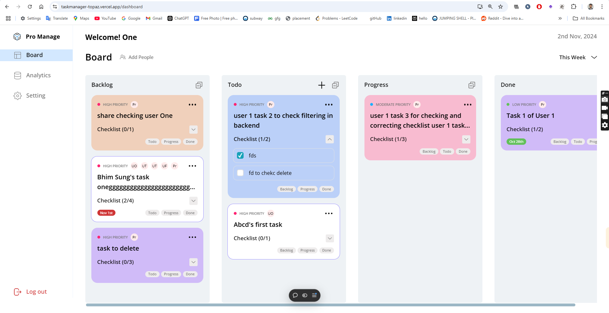

# 📝 **Task Manager** - Simplify Your Workflow

**Task Manager** is a powerful, intuitive tool designed to help you organize, prioritize, and track your tasks effectively. With features for assigning, prioritizing, and personalizing tasks, Task Manager makes team collaboration and productivity smoother than ever.

## [Live Demo](https://taskmanager-topaz.vercel.app/)

## 🖼️ **Interface Previews**

*A clean and organized view of all tasks*

*Detailed view of task priority, checklist, and customization options*

---

## ✨ **Features**

- 🔒 **User Authentication**: Register and log in to securely access your tasks.
- 📝 **Task Creation & Management**:
  - Add tasks with a title, description, priority level, checklist items, and color.
  - Assign tasks to any other authenticated user.
  - Edit, delete, and share tasks with just a few clicks.
- ✅ **Checklist & Completion**: Mark checklist items as completed and track task progress.
- 🎨 **Customizable Task Colors**: Personalize tasks with different colors for easier categorization.

---

## 🛠️ **Tech Stack**

| Technology       | Description                 |
|------------------|-----------------------------|
|  **JavaScript**  | Core language for client and server-side code |
|  **Node.js**    | Backend server for managing API requests       |
|  **MongoDB**   | NoSQL database for storing tasks and users     |
|  **Express** | Server framework for building API endpoints |
|  **React**      | Frontend framework for user interface         |
|  **Mongoose** | ODM for MongoDB to structure and manage data |

---

## 🚀 **Getting Started**

## Setup Instructions
1. 🌀 Clone the repository from [GitHub Repository URL](https://github.com/Vicky8180/vyadav99x1_gmail.com_cuvette_final_evaluation_feb_3).
2. 📁 Navigate to the project directory.
3. ⚙️ Install dependencies by running `npm install`.
4. 🚀 Start the development server by running `npm start`.
5. 🌐 Access the app locally at `http://localhost:3000` in your web browser.

## Contributing
Contributions to the Food Delivery App project are welcome! Here are some ways you can contribute:
- 🐛 Report any bugs or issues by opening a GitHub issue.
- 💡 Submitting feature requests.
- 📝 Providing feedback and suggestions for improvement.
- 🛠️ Contributing code enhancements or fixes via pull requests.

Please adhere to the project's code of conduct and follow the guidelines specified in the CONTRIBUTING.md file.

## License
This project is licensed under the [MIT License](https://opensource.org/licenses/MIT). Feel free to use, modify, and distribute the code for personal or commercial purposes.

## Acknowledgements
- The developers and maintainers of React, Redux, TypeScript, and other technologies used in this project.
- Open source contributors who have provided valuable resources and libraries.

## Contact
For any inquiries or further information about the project, please contact Anoop Yadav at [Email](vyadav99x1@gmail.com).
